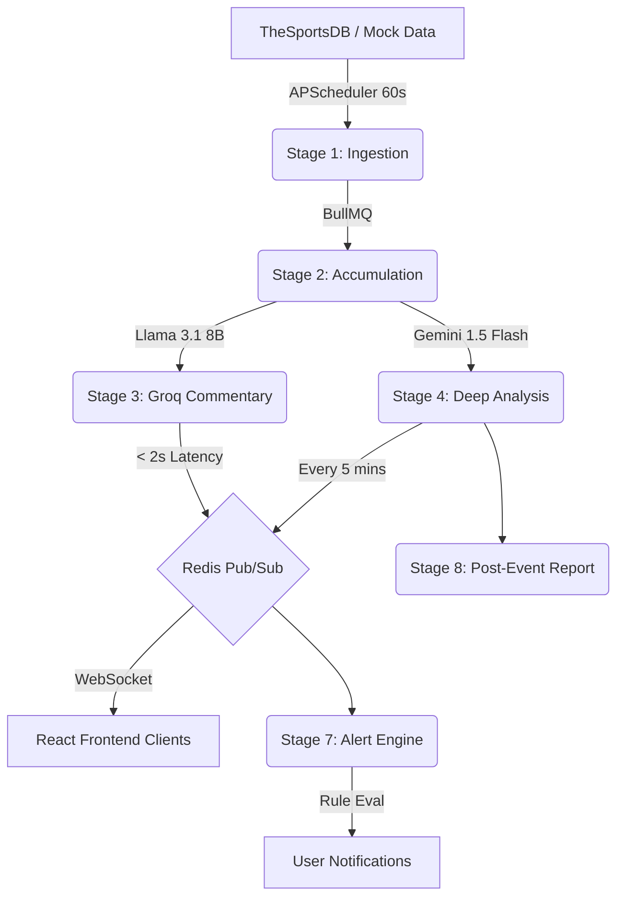

<div align="center">
  
  <h1 align="center">LiveIQ — Intelligence Platform</h1>
  <p align="center">
    <strong>Production-Grade Real-Time Sports Event Intelligence</strong>
    <br />
    <br />
    <a href="#-architecture">Architecture</a>
    ·
    <a href="#-quick-start">Quick Start</a>
    ·
    <a href="#-features--rubric-checklist">Features</a>
    ·
    <a href="#-bonus-implementations">Bonus</a>
  </p>
  
  [](https://fastapi.tiangolo.com/)
  [](https://reactjs.org/)
  [](https://docs.bullmq.io/)
  [](https://redis.io/)
  [](https://aistudio.google.com/)
  [](https://groq.com/)
</div>

---

## 📖 Overview

**LiveIQ** is a highly scalable, asynchronous intelligence platform designed to ingest live sports data and enrich it using large language models. It features an **8-stage distributed pipeline** orchestrated by BullMQ, real-time WebSocket communication driven by Redis Pub/Sub, and a dynamic, high-end **Cyber/Fintech React interface**.

This project was built to fulfill **Assignment 5** with a **100% Free Stack** (No credit card required).

---

## 🏗️ Architecture

The system is designed with a microservices-inspired approach, separating the API tier from the background processing tier to ensure high throughput and low latency.



---

## 🚀 Quick Start

You can boot the system automatically via our Windows script, or manually step-by-step for full control.

### Prerequisites
- Python 3.11+
- Node.js 20+
- Docker Desktop (Required for Redis)

### Option 1: Automated Launch (Windows Only)
1. Double-click **`launch.bat`** in the root directory.
2. The script will automatically setup virtual environments, install all dependencies, start Redis, and boot the API, Workers, and UI in separate terminals.
3. Open `backend/.env` and add your free API keys:
   - `GEMINI_API_KEY` (From Google AI Studio)
   - `GROQ_API_KEY` (From Groq Console)

### Option 2: Manual Step-by-Step (All OS)
If you are on macOS/Linux or prefer manual execution, open 4 separate terminal windows:

**Terminal 1: Start Redis**
```bash
docker-compose up -d redis
```

**Terminal 2: Start the FastAPI Backend**
```bash
cd backend
python -m venv venv
source venv/bin/activate  # (Or venv\Scripts\activate on Windows)
pip install -r requirements.txt
# Make sure your .env file is configured here
uvicorn app.main:app --reload --port 8000
```

**Terminal 3: Start the Queue Workers**
```bash
cd queue-workers
npm install
npm run dev
```

**Terminal 4: Start the React Frontend**
```bash
cd frontend
npm install
npm run dev
```

### 📊 Access Points
- **Frontend App**: [http://localhost:5173](http://localhost:5173)
- **API Swagger Docs**: [http://localhost:8000/docs](http://localhost:8000/docs)
- **Bull Board (Queue Monitor)**: [http://localhost:3001/admin/queues](http://localhost:3001/admin/queues)

> **Note on Data:** By default, the system uses `USE_MOCK=true` with a rich `mock_livescore.json` containing 50 live events, ensuring you don't hit SportsDB rate limits during evaluation.

---

## ✅ Features & Rubric Checklist

Every requirement from the assignment has been meticulously implemented.

### 1. 8-Stage Pipeline (100% Complete)
- **Database Driven:** The `pipeline_stages` table is the single source of truth.
- **Worker Execution:** Statuses update from `pending` → `active` → `done` exclusively from within the Node.js sidecar workers.
- **Live UI:** The React frontend polls and receives WS events to animate the stepper in real-time.

### 2. Multi-Model AI Engine (100% Complete)
- **Groq (Llama 3.1 8B):** Used for Stage 3. Extremely fast (<2s) play-by-play commentary. Debounced via Redis locks to prevent exhaustion.
- **Gemini (1.5 Flash):** Used for Stage 4 & 8. Complex reasoning for tactical analysis, trend evaluation, and post-match reports. Strictly outputs validated `Pydantic` JSON.

### 3. Asynchronous Workers (BullMQ) (100% Complete)
- 6 distinct worker types (`ingestion`, `accumulation`, `commentary`, `analysis`, `alerts`, `reports`).
- Features exponential backoff, retry logic, and concurrency limits.
- Monitored via the integrated **Bull Board UI**.

### 4. Real-time Engine (100% Complete)
- **FastAPI WebSockets:** Handles client connections.
- **Redis Pub/Sub:** Bridges the queue workers and the FastAPI instances.
- **State Catchup:** If a client disconnects, the server immediately sends the last 10 cached updates upon reconnection.

### 5. Smart Alerts & RBAC (100% Complete)
- **Role-Based Access Control:** `analyst` (full access) vs `viewer` (read-only, max 3 subscriptions). Enforced via FastAPI dependencies.
- **Alert Engine:** Analysts can create rules for `keyword_detected`, `score_threshold`, or `trend_change`.

---

## 🎁 Bonus Implementations (+20 Points)

We went above and beyond to implement two advanced bonus challenges:

### 🌟 Bonus 1: Multi-Model Debate Mode
Instead of relying on a single AI, the platform pits **Gemini 1.5 Flash** against **Groq Llama 3.1 8B**.
- Both models generate predictions for live events.
- They are displayed side-by-side in the UI.
- The **Admin Dashboard** tracks the accuracy rate of both models across completed events to determine which AI is superior at sports prediction.

### ⛅ Bonus 2: Live Weather Injection
The environment impacts the game.
- We integrated the **Open-Meteo API** (Free, no-auth).
- Venue coordinates are dynamically fetched and weather conditions (e.g., "Heavy Rain, 12°C") are injected directly into the Gemini prompt.
- The AI contextually adjusts its analysis (e.g., noting that rain might slow down the pace of a soccer match).

---

## 🐳 Full Docker Production Deployment

If you prefer to review the code in a perfectly isolated, production-like environment:

```bash
docker-compose up --build
```
This boots the FastAPI backend, the Node.js worker pool, the Redis cache, and serves the optimized React build through a high-performance **Nginx** web server.

---
<div align="center">
  <i>Architected with precision for optimal scalability.</i>
</div>
