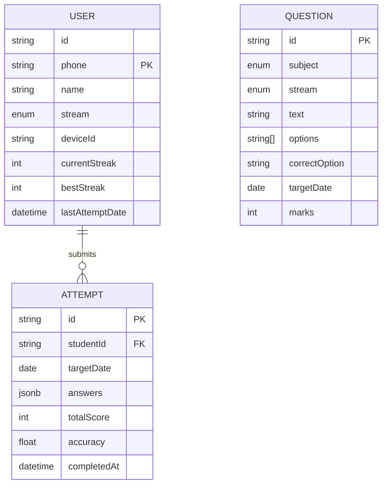

# **Database Design Specification (v1.0)**

## **1. Overview**
The database is designed for **PostgreSQL** (via Supabase/Prisma) to handle high-concurrency submissions (up to 500 simultaneous) while maintaining strict data integrity for streaks and scoring.

---

## **2. Core Entities**

### **2.1 User (Student & Admin)**
*   **Device Binding:** Each student record stores a `deviceId`. On login, the system compares the incoming hardware ID with this field.
*   **Streak Logic:** `currentStreak` and `lastAttemptDate` are used to calculate whether a streak is maintained or broken.

### **2.2 Question Bank**
*   **Daily Set:** Questions are tagged with a `targetDate`.
*   **Streams:** Questions are mapped to `PCM` or `PCB` enums.
*   **Subject Distribution:** Each day requires 150 questions (50 per subject).

### **2.3 Attempts & Scoring**
*   **Atomic Attempt:** Each student can have only one `Attempt` record per `targetDate`. 
*   **Answer Storage:** Student answers are stored as a JSONB object for flexibility and fast retrieval.
*   **Immediate Scoring:** Scores and accuracy are calculated on-the-fly and persisted to the `Attempt` table.

---

## **3. Performance Strategy (500 Concurrent Users)**

*   **Indexing:** 
    *   Index on `Attempt(studentId, targetDate)` to prevent duplicate submissions.
    *   Index on `Question(targetDate, stream)` for fast fetching at 12:00 PM.
*   **Atomic Operations:** Using Prisma's `$transaction` for submission to ensure that the `User` streak and `Attempt` record are updated together or not at all.
*   **Redis Integration:** Before hitting PostgreSQL, a Redis key `attempt_lock:{studentId}:{date}` will be set to block multiple rapid "Submit" clicks.

---

## **4. Data Model (Mermaid Diagram)**

