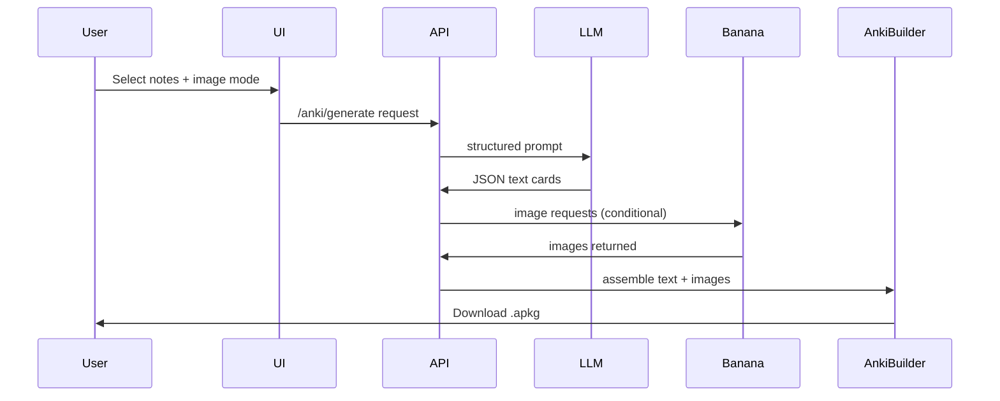

---
```markdown
# Image Control Options in UI

+------------------------------------------------+
| Generate Anki Deck                             |
+------------------------------------------------+
| Include Images?   [ Off | Helpful | All | Custom ▼ ] |
| Image Style:      [ Diagrams ▼ ]               |
| Topic:            [ Transformer Attention ]    |
| Max Cards:        [ 30 ]                       |
| Difficulty:       [ Advanced ]                 |
| Study Focus:      [ Conceptual ]               |
| [ Preview Cards ]        [ Generate ]          |
+------------------------------------------------+